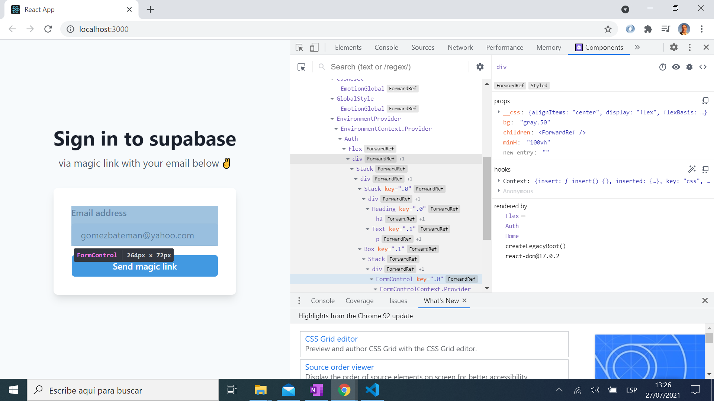
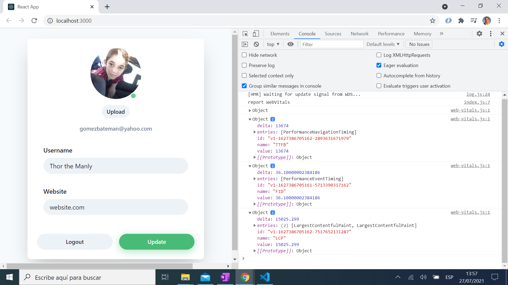

# :zap: React Supabase Authentication

* React frontend with a Supabase PostgreSQL database backend
* Tutorial code from [CodingAndCaffeine](https://www.youtube.com/channel/UCQk_kRUoxJQY5vqbJQFgJDA) - see [:clap: Inspiration](#clap-inspiration) below. Modified to show Web Vitals user data as measured by Chrome
* **Note:** to open web links in a new window use: _ctrl+click on link_


## :page_facing_up: Table of contents

* [:zap: React Supabase Authentication](#zap-react-supabase-authentication)
  * [:page_facing_up: Table of contents](#page_facing_up-table-of-contents)
  * [:books: General info](#books-general-info)
  * [:camera: Screenshots](#camera-screenshots)
  * [:signal_strength: Technologies](#signal_strength-technologies)
  * [:floppy_disk: Setup](#floppy_disk-setup)
  * [:flashlight: Testing](#flashlight-testing)
  * [:computer: Code Examples](#computer-code-examples)
  * [:cool: Features](#cool-features)
  * [:clipboard: Status & To-Do List](#clipboard-status--to-do-list)
  * [:clap: Inspiration](#clap-inspiration)
  * [:file_folder: License](#file_folder-license)
  * [:envelope: Contact](#envelope-contact)

## :books: General info

* Supabase is an open-source alternative to Firebase, but uses Postgres instead of document database. Database is realtime & can use SQL joins. Realtime notifications via Websockets. RESTful API requires no backend code.

## :camera: Screenshots




## :signal_strength: Technologies

* [React v17](https://reactjs.org/) Javascript library
* [Chakra-ui/react v1](https://www.npmjs.com/package/@chakra-ui/react) React components that work out of the box.
* [Supabase public Beta](https://supabase.io/) Postgres database
* [supabase-js v1](https://www.npmjs.com/package/@supabase/supabase-js) isomorphic Javascript client for Supabase
* [web-vitals v1](https://www.npmjs.com/package/web-vitals) library to measure the Web Vitals metrics of real users

## :floppy_disk: Setup

* `npm i` to install dependencies then...
* Create free account with Supabase and create table from SQL menu/User Management Starter as per [tutorial](https://www.youtube.com/watch?v=x38PWNZhSEM)
* Create `.env.local` then add your Supabase API Authentication credentials as shown in `.env.example.local`
* `ng serve` for a dev server. Navigate to `http://localhost:4200/` - app will automatically reload if you change any of the source files
* `ng run build` for a build folder

## :flashlight: Testing

* Tests not set up

## :computer: Code from [Tutorial](https://www.youtube.com/watch?v=x38PWNZhSEM)

* `Account.js` function to get user profile from Supabase

```javascript
async function getProfile() {
		try {
			setLoading(true);
			const user = supabase.auth.user();

			let { data, error, status } = await supabase
				.from("profiles")
				.select(`username, website, avatar_url`)
				.eq("id", user.id)
				.single();

			if (error && status !== 406) {
				throw error;
			}

			if (data) {
				setUsername(data.username);
				setWebsite(data.website);
				setAvatarUrl(data.avatar_url);
			}
		} catch (error) {
			alert(error.message);
		} finally {
			setLoading(false);
		}
	}
```

## :cool: Features

* Supabase user interface is cool to work with and they have SQL templates to create a user login etc.

## :clipboard: Status & To-Do List

* Status: Working
* To-Do: Nothing

## :clap: Inspiration

* [React + Supabase Authentication Tutorial | Intro](https://www.youtube.com/watch?v=Nq12Ebchtko)
* [React + Supabase Authentication Tutorial | Implementation](https://www.youtube.com/watch?v=x38PWNZhSEM)
* [Diligent Dev: Supabase - The Open-source Alternative to Firebase](https://www.youtube.com/watch?v=RpnDkUMNzK0)
* [StackOverflow: Auto Import of React Components in Visual Studio Code](https://stackoverflow.com/questions/60637561/auto-import-of-react-components-in-visual-studio-code)

## :file_folder: License

* N/A

## :envelope: Contact

* Repo created by [ABateman](https://github.com/AndrewJBateman), email: gomezbateman@yahoo.com